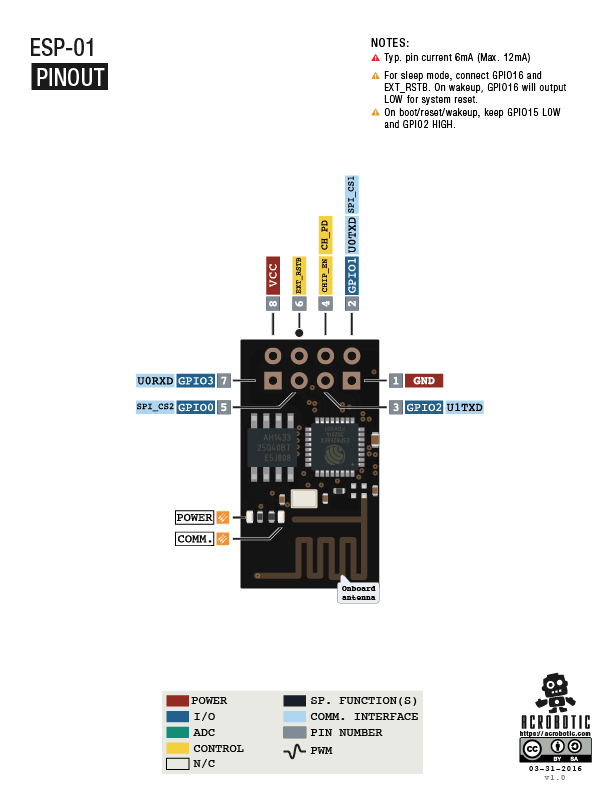
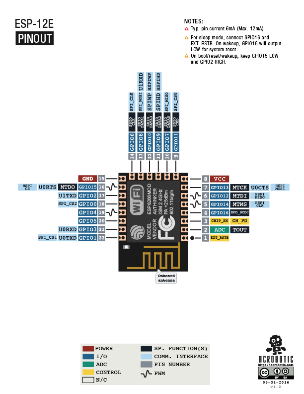

= ESP8266

== Links

* https://www.espressif.com[Сайт платформы]
* https://www.espressif.com/en/support/download/documents[Документация]

== Important 

* Напряжение питания 3.3v
* Потребление тока: ??? более 60Ma, поэтому питание от Arduino недостаточно, используй внешнее питание 3.3v
* При использовании внешнего питания необходимо использовать общую с Arduino землю!

== Варианты ESP8266

=== ESP-01

=== ESP-12x 

== Инструменты 

=== esptool 

esptool - инструмент командной строки от производителя для прошивки ESP. Написан на питоне.

vcs: https://github.com/espressif/esptool

.Установка
----
pip install esptool
----

=== socat - socket relay

Used to create local tty for remote ip

----
pip install socat
----

== Подключение

=== К компу через USB-TTL

* Идеальный вариант: image::images/usb-to-ttl-esp8266.jpg[USB-TTL with ESP8266 adapter]
* Альтернативный вариант: image::images/usb-to-ttl.jpg[USB-TTL]

* Питания USB-TTL может не хватать, если не работает, лучше подключить от внешнего источника. 
* Режим загрузки и прошивки может включаться автоматом если подключить пины
** EN|CH_PD ("enable") or RESET -- RTS
** GPIO0 -- DTR

==== ESP-01

[graphviz, esp8266-01wiring, svg]
----
graph esp8266-01wiring {
    ESP(RX) -- USBTTL(TX)
    ESP(TX) -- USBTTL(RX)
    
    ESP(EN|CH_PD) -- POWER(VCC)
    ESP(VCC) -- POWER(VCC)

    ESP(GND) -- POWER(GND)
    ESP(GPIO0) -- POWER(GND) [label = "Flashing mode"]
}
----

==== ESP-12x 

[graphviz, esp8266-12wiring, svg]
----
graph esp8266-12wiring {
    ESP(RX) -- USBTTL(TX)
    ESP(TX) -- USBTTL(RX)
    
    ESP(EN|CH_PD) -- POWER(VCC)
    ESP(VCC) -- POWER(VCC)

    ESP(GND) -- POWER(GND)
    ESP(GPIO15) -- POWER(GND)
    ESP(GPIO0) -- POWER(GND) [label = "Flashing mode"]
}
----

==== Проверка работоспособности

* Подключить согласно схеме выше
* Подключить монитор порта (baud=115200)
* Передернуть питание. В мониторе должна появиться инфа о готовности.

=== Подключение к Arduino

[graphviz, esp8266-arduino-wiring, svg]
----
graph esp8266-arduino-wiring, {
    ESP(RX) -- Arduino(TX)
    ESP(TX) -- Arduino(RX)
    
    ESP(EN|CH_PD) -- POWER(VCC)
    ESP(VCC) -- POWER(VCC)

    ESP(GND) -- POWER(GND)
    ESP(GND) -- Arduino(GND)
}
----

.Важно
* ESP хорошо работает с HardwareSerial, но если эти порты заняты, можно использовать любые другие пины и SoftwareSerial(receivePin, transmitPin)
* SoftwareSerial очень плохо работает на родной для ESP скорости: 115200. Необходимо переключить на 9600:

----
AT+UART_DEF=9600,8,1,0,0
----

== Firmwares

=== Standard (AT commands)

Стандартная прошивка для управления ESP AT командами.

==== Installation

----

# download url
# https://www.espressif.com/en/support/download/at
clone git@github.com:espressif/ESP8266_AT.git

cd ESP8266_AT/bin

esptool.py write_flash \
    0x00000 boot_v1.1.bin \
    0x01000 v0.20/user1.bin \
    0x7C000 esp_init_data_default.bin \
    0x7E000 blank.bin
----

==== Initial settings

* AT+CWMODE_DEF=1 - режим работы (1 - station, 2 - access point, 3 - both)
* AT+CWLAP - список доступных сетей
* AT+CWJAP="SSID","password" - подключиться к сети
* AT+CIFSR - вывести IP (после подключения)

=== esp-link (Wifi-Serial Bridge)

Прошивка для удаленной (WiFi) прошивки и управления микроконтроллерами.

==== Links

* https://github.com/jeelabs/esp-link

==== Installation for esp-01

https://github.com/jeelabs/esp-link/blob/master/FLASHING.md#initial-serial-flashing

* Enter ESP flashing mode: wire GPIO0 -- GND
* Flash esp-link firmware

.firmware/esp-link/flash-esp-link.sh
----
curl -L http://s3.voneicken.com/esp-link/esp-link-v3.0.14-g963ffbb.tgz | tar xzf -

cd esp-link-v3.0.14-g963ffbb

# For 8Mbit / 1MByte modules the addresses are 0xFC000 and 0xFE000
# ESP-01
esptool.py --port /dev/ttyUSB0 --baud 460800 --chip auto \
    write_flash \
    0x00000 boot_v1.6.bin \
    0x01000 user1.bin \
    0xFC000 esp_init_data_default.bin \
    0xFE000 blank.bin
----

* Exit flashing mode: disconnect GPIO0 and GND

==== Configuration

https://github.com/jeelabs/esp-link/blob/master/WIFI-CONFIG.md

* Search WiFi endpoint with name 'ESP_xxxxx'
* Connect to this endpoint 
* Open http://192.168.4.1/home.html
    ** Pin assignment: select esp-01, this will set following values:
        *** Reset: gpio0
        *** ISP/Flash: disabled
        *** Conn LED: gpio2/TX1
        *** Serial LED: disabled
        *** UART pins: normal
        *** RX pull-up: true
    ** Press 'Change!'
* Open 'WiFi Station' page  
    ** WiFi Association: connect to your wifi network
    ** Special settings: Specify static IP
    ** WiFi State: Switch to STA mode

==== ESP-Arduino wiring

----
ESP        - Arduino
RX(GPIO3)  - TX
TX(GPIO1)  - RX
gpio0      - Reset
----

